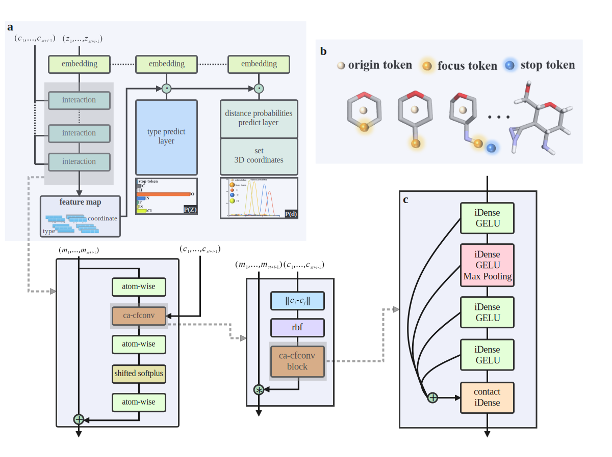

# <div align='center'><font face="Times New Roman" size='70'>3D-SMGE</font></div>

Paper *"3D-SMGE:A Pipeline for Molecules Generate and Evaluate based on Scaffolds"*

## Summarize

3D-SMGE is a scaffold-based neural network pipeline for 3D molecular generation and evaluation. 3D-SMGE presented  in this work consists of two main modules, the molecular generation module named 3D-SMG and the ADMET prediction module. 3D-SMG uses atomic coordinates and atomic types as molecular representation. The generation of 3D molecules in 3D euclidean space is based on two generative approaches. If only provide scaffold structure and no position is specified, the chain generation will be performed for all possible in the scaffold. This way named approach1. If specific positions is also provided, the side chain generation will performed at the provided positions. This way named approach2. In the ADMET properties prediction module，we propose the data adapted multi-models that 24/27 surpassed or maintained the highest accuracy on the benchmark dataset metrics. We train the 3D-SMG on the ZINC-5w data set which filtered from ZINC-Standard data set with the heavy atoms from fluorine, oxygen, nitrogen, and carbon, slfur, chlorine. During the generation，you can provide SMILES, PDB, mol2 files for molecular generation.




## Requirements

* rdkit>=2019.03.4
* openbabel>=3.0.0
* torch>=1.8.0
* PyTDC>=0.3.3
* DeepPurpose >=0.1.5
* schnetpack>=0.3

## Getting start

### Data Preparation

* 1. Clone the repsitory into the local folder:

```shell
git clone git@github.com:ZheLi-Lab-Collaboration/3D-SMGE.git
```

* 2. Conditionally filtered molecules, this step is to select different databases and filter criteria based on your own requirements.
* 3. Prepare the dataset for the deep generative model 3D-SMG.

```shell
python prepareDatatset.py --xyz_path ./xyz_files
```

* 4. Move the generated DB file `SMGE3D.db`to the`./data` folder.

### Training the Deep Generative Model 3D-SMG

* If you want to change some hyperparameters, you can read the explanation in `SMG_3D.py`

```shell
python SMG_3D.py train 3D_SMG ./data/ ./model --split 37905 2527 --cuda --batch_size 5 --draw_random_samples 5 --features 128 --interactions 7 --caFilter_per_block 4 --max_epochs 1000
```

* If you have multiple GPUs, we also provide code for parallel training.

````shell
torchrun --standalone --nnodes=1 --nproc_per_node=4 SMG_3D_parallel.py train 3D_SMG ./data/ ./model --split 37905 2527 --cuda --parallel --batch_size 5 --draw_random_samples 5 --features 128 --interactions 7 --caFilter_per_block 4 --max_epochs 1000
````

### Eval and Test the Deep Generative Model 3D-SMG

* One GPU

```shell
python SMG_3D.py eval 3D_SMG  ./data/ ./model --split validation --cuda --batch_size 5 --features 128 --interactions 7 --caFilter_per_block 4
```

```shell
python SMG_3D.py test 3D_SMG  ./data/ ./model --split test --cuda --batch_size 2 --features 128 --interactions 7 --caFilter_per_block 4
```

* Multi-GPUs

```shell
torchrun --standalone --nnodes=1 --nproc_per_node=1 SMGE_3D_eval_single_gpu.py eval 3D_SMG  ./data/ ./model --split validation --cuda --parallel --batch_size 3 --features 128 --interactions 7 --caFilter_per_block 4
```

```shell
torchrun --standalone --nnodes=1 --nproc_per_node=1 SMG_3D_eval_single_gpu.py test 3D_SMG  ./data/ ./model --split test --cuda --parallel --batch_size 5 --features 128 --interactions 7 --caFilter_per_block 4
```

### Generating Molecules with  the Deep Generative Model 3D-SMG

During the generating molecules, we provide three scaffold input formats and two generation modes.

* First generation mode:  If only provide scaffold structure and no position is specified, the chain generation will be performed for all possible in the scaffold. 

  * SMILES input format:

    ```shell
    python SMG_3D.py generate 3D_SMG ./model/ 100 --scaffold 'CC(C1=CC=C(OC)C(OC)=C1)=O' --genMode mode1 --inputFormat smiles --chunk_size 100 --cuda --max_length 60 --file_name scaffold
    ```

  * PDB input format (re-saved as a.pdb file through Discover Studio, Maestroo, *etal.*):

    ```shell
    python SMG_3D.py generate 3D_SMG ./model/ 100 --genMode mode1 --inputFormat pdb --file3D_path ./pdb_luo.pdb --chunk_size 100 --cuda --max_length 60 --file_name scaffold
    ```

  * mol2 input format (re-saved as .mol2 file through Discover Studio, Maestro, *etal.*):

    ```shell
    python SMG_3D.py generate 3D_SMG ./model/ 100 --genMode mode1 --inputFormat mol2 --file3D_path ./pdb_luo.mol2 --chunk_size 100 --cuda --max_length 60 --file_name scaffold
    ```

* Second generation mode: If specific positions is also provided, the side chain generation will performed at the provided positions.

  * SMILES input format:  

    ```shell
    python SMG_3D.py generate 3D_SMG ./model/ 100 --scaffold 'CC(C1=CC=C(OC)C(OC)=C1)=O' --genMode mode2 --have_finished  1 2 3 4 6 7 8 9 10 11 12 13 --inputFormat smiles --chunk_size 100 --cuda --max_length 60 --file_name scaffold
    ```

    If you choose the SMILES input format with second generation mode,  you are supposed to determine the specific positions of the scaffold,  then use the `Rdkit` to figure out the positions of scaffold.  The  implementation is as follows. --have_finshed represents which positions are not required for molecular generation.

    ```python
    def get_desired_atom_idx(smiles:str):
        scaffold_mol = Chem.MolFromSmiles(smiles)
        # mol = Chem.AddHs(scaffold_mol)
        for atom in scaffold_mol.GetAtoms():
            atomIdx = atom.GetIdx()
            print(atomIdx, end="\t")
            atomNum = atom.GetAtomicNum()
            print(atomNum, end="\t")
            print(atom.GetSymbol(), end="\t")
            print(atom.GetDegree(), end="\t")
            ExpValence = atom.GetTotalValence()
            print(ExpValence, end="\t")
            print("\n")
    ```

  * PDB input format (re-saved as .pdb file through Discover Studio, Maestro, *etal.*):

    ```shell
    python SMG_3D.py generate 3D_SMG ./model/ 100 --genMode mode2 --inputFormat pdb --file3D_path ./pdb_luo.pdb --chunk_size 100 --cuda --max_length 60 --file_name scaffold
    ```

    If you choose the PDB input format with second generation mode, you should edit atom using "*" to mark special positions for molecular generation. The following figure shows the marking method:

    

  * mol2 input format (re-saved as .mol2 file through Discover Studio, Maestro, *etal.*):  

    ```shell
    python SMG_3D.py generate 3D_SMG ./model/ 100 --genMode mode2 --inputFormat mol2 --file3D_path ./pdb_luo.mol2 --chunk_size 100 --cuda --max_length 60 --file_name scaffold
    ```

    If you choose the mol2 input format with second generation mode, you should edit atom using "*" to mark special positions for molecular generation. The following figure shows the marking method:

    

### Filter the Generated Molecules

```shell
python filter_generated.py ./model/generated/scaffold.mol_dict 
```

### Displaying Generated Molecules

```shell
python display_generateMolcules.py  ./model/generated/generated_molecules.db
```

### Convert the Generated Molecules into `.xyz` File

```shell
python write_xyz_files.py ./model/generated/
```

### Convert the  `.xyz` File into `.smi` File

```
python xyz_to_smiles.py ./model/generated
```

For the final generated molecules, we not only provide 2D SMILES format, but also provide 3D XYZ format.

### ADMET Predicition

Firstly, you are supposed to move the generated molecules `agg_smi.smi` to the  `./data` folder.

````shell
python ./property_Pred\ADMET/general_admet/admet-pred.py --smi_path ../data/agg_smi.smi --csv_path ../data/smi_csv.csv --admet_result_path ../data/final_admet.csv
````


### Fundamental Properties Prediction

```shell
python ./property_Pred/base/base_feature.py --csv_path ../data/smi_csv.csv --baseP_result_path ../data ../data/baseP_result.csv
```


We provide 8 fundamental predictions such as `logP`, `SAScore`, `QED`, `TPSA`, `NumHAcceptors`, `NumHDonors, ` `NumRotatableBonds`, `NumAliphaticRings`

## Dataset and Weights File

### Deployment Weights for ADMET Prediction

You are supposed to unzip the weights file and put it in `./property_Pred/ADMET/best-model`                                        

[**<u>ADMET Prediction</u>**](https://drive.google.com/file/d/1mk1iNDypbOsqYRj4TzoKej69MWBBrxgH/view?usp=sharing)

###  A Small Dataset for Testing the 3D-SMGE 

You are supposed to unzip the dataset file and put it in `./data/` for training.         

 [<u>**DatsetDB**</u>](https://drive.google.com/file/d/16-s6fvKTV6KJJ-8cBPSkVvaSQmfGInHb/view?usp=sharing)

### The Deep Generative Model 3D-SMG Deployment Weights for Testing

You are supposed to unzip the weights file and put it in the root directory for  evaluating, testing model and generating molecues.

<u>**[3D-SMG Model Weights](https://drive.google.com/file/d/14c65EiA8gWlGhIxEyHtlp-NL68qDqN7P/view?usp=drive_link)**</u>

## Citation

If you find this useful, please consider citing our paper:

```
@article{10.1093/bib/bbad327,
    author = {Xu, Chao and Liu, Runduo and Huang, Shuheng and Li, Wenchao and Li, Zhe and Luo, Hai-Bin},
    title = "{3D-SMGE: a pipeline for scaffold-based molecular generation and evaluation}",
    journal = {Briefings in Bioinformatics},
    pages = {bbad327},
    year = {2023},
}
```

